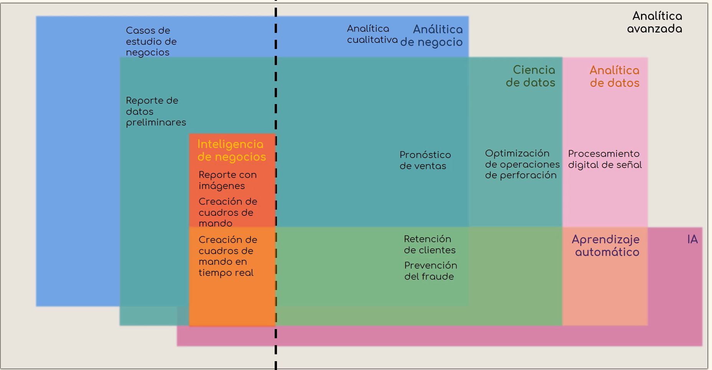

# 📊 **Ciencia de Datos**  

## 🔍 **Inteligencia de Negocios**  
📌 Proceso de análisis y reporte de los datos históricos del negocio.  
📌 Incluye herramientas tecnológicas para analizar, comprender y comunicar datos del pasado.  

### ❓ **¿Cómo y por qué?**  

---

## 📌 **Métodos Tradicionales**  
🔹 **Conjunto de métodos derivados de la estadística, adaptados a los negocios.**  
🔹 **Útiles para pronosticar el rendimiento futuro con gran precisión.**  

📌 **Principales técnicas:**  
✅ **Análisis de Regresión**  
✅ **Análisis de Agrupación**  
✅ **Análisis Factorial**  

---

## 🤖 **Aprendizaje Automático (Machine Learning)**  
📌 Creación de algoritmos que analizan datos de entrada para realizar análisis estadísticos avanzados.  

---

## 📚 **Conceptos Clave**  

### 🧠 **Inteligencia Artificial**  
📌 Simulación computacional del conocimiento y la toma de decisiones humanas.  

### 📊 **Datos**  
📌 Información almacenada digitalmente que se usa como base para análisis y toma de decisiones.  

🔹 **Tipos de datos:**  
📌 **🟢 Datos Tradicionales** – Datos concretos y estructurados.  
📌 **🔵 Macrodatos (Big Data)** – Gran volumen de datos estructurados, semiestructurados o no estructurados.  

📌 **🔑 Factores clave en Big Data:**  
✅ **Volumen** – Cantidad de datos generados.  
✅ **Variedad** – Diversidad en tipos y fuentes de datos.  
✅ **Velocidad** – Rapidez con la que se generan y procesan.  

---

## 📊 **Analítica**  

### 🚀 **Analítica Avanzada**  
📌 Aplicación de técnicas avanzadas para extraer valor de los datos.  

📌 **Ejemplo gráfico:**  
  

---

